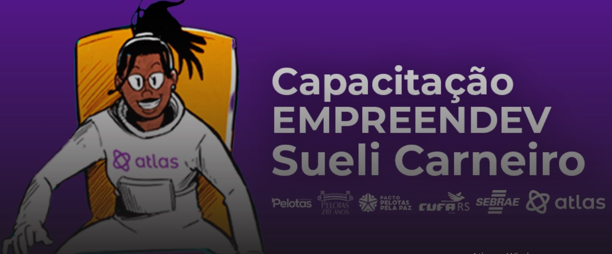

## Be Academy - Atlas(Capacitação Empreendev Sueli Carneiro).

### Descrição:

Módulo: Lógica de Programação - Conteúdo estudado: 
Conceito de Lo패gica e Algoritmo VisualG e Vari치veis Constantes, Comandos de Atribuic퍊a팪o  
e Comenta패rios Operadores Aritme패ticos, Relacionais, Lo패gicos, Caracteres, Leitura e Sai패da de Dados  
Se, Senão Se e Senão Switch-Case Estrutura de Repeticao Para (For) Estrutura de Repeticao - Enquanto (while)   Estrutura de Repeticao - Enquanto Repita-ate (Do While) Estruturas de Dados, Matriz.

### 🛠 Conteúdo do Curso:
- Lógica de Programação

### Status do Projeto:
50% concluido, ainda falta um pouco, favor aguardar!

### Autor: Professor Marcos Monteiro
Projeto desenvolvido por [Marcos Franco](https://www.linkedin.com/in/marcosfranco-5b1a8a111/)

### Contatos:
Linkedin: https://www.linkedin.com/in/marcosfranco-5b1a8a111/

Github: https://github.com/marcos-franco

WhatSapp: https://contate.me/marcos-franco

E-mail: masf68@hotmail.com
